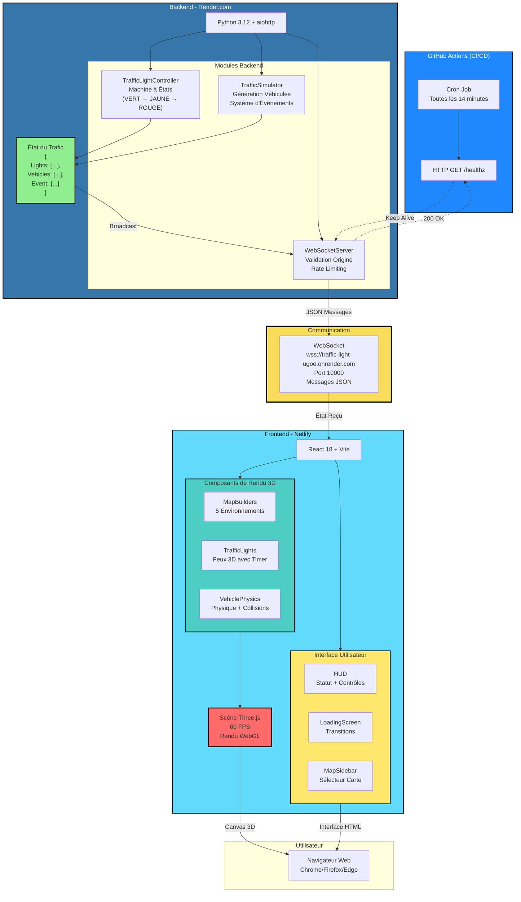
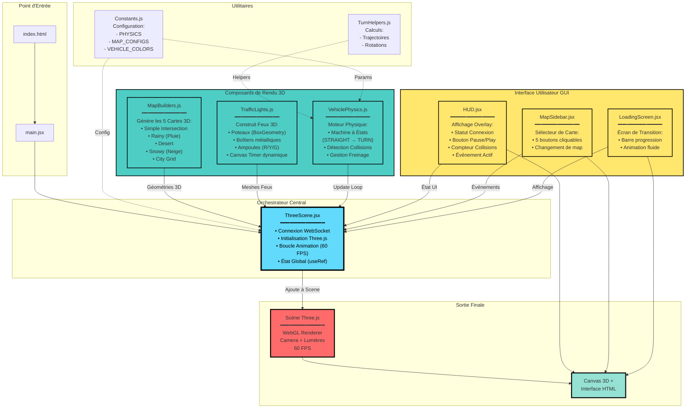
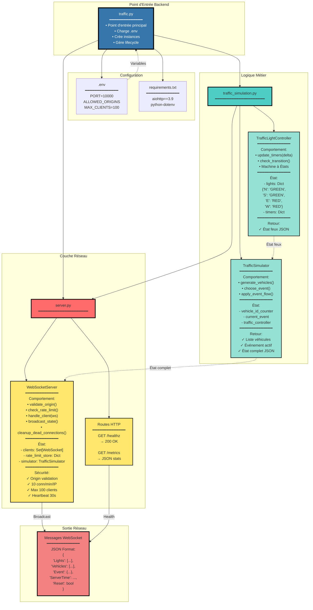
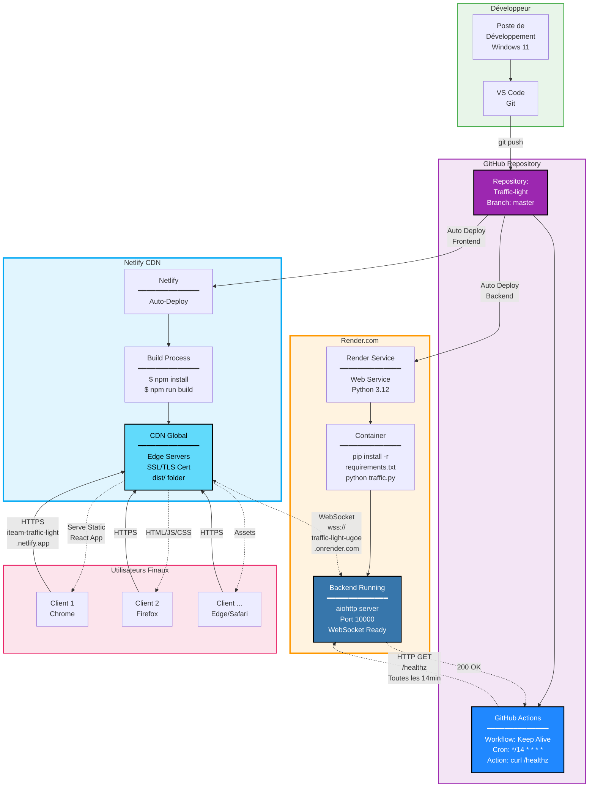
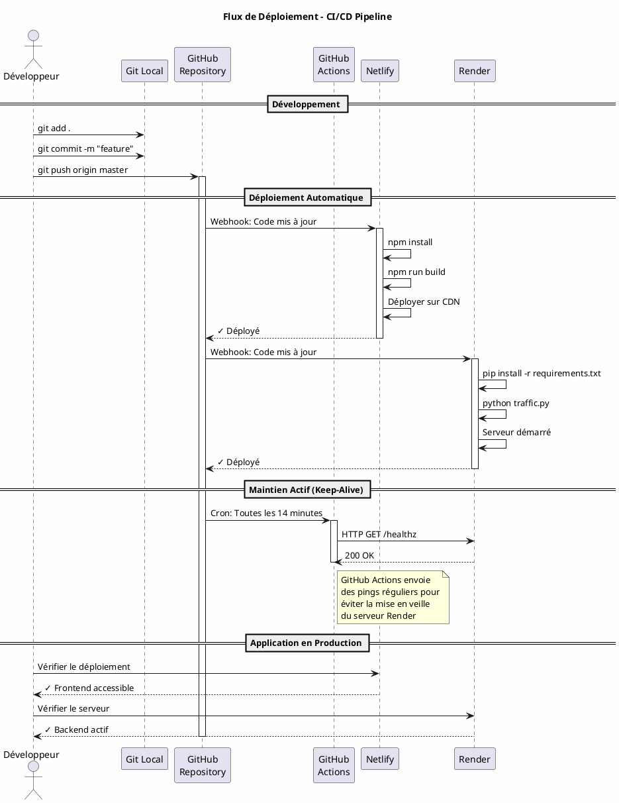
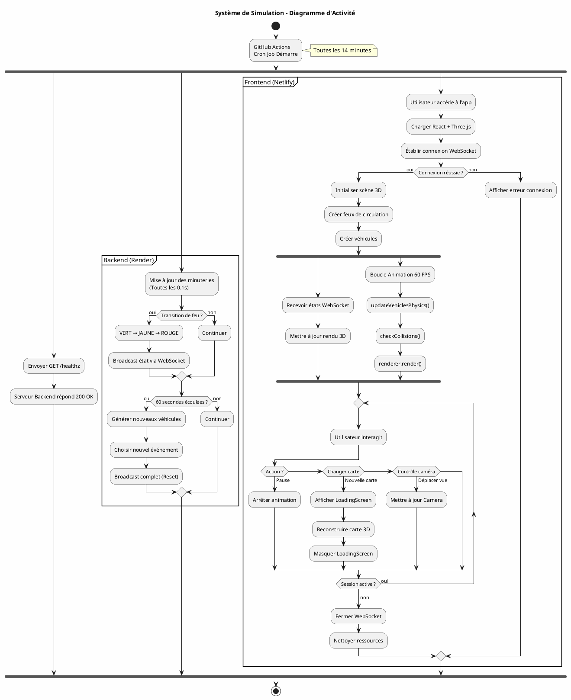
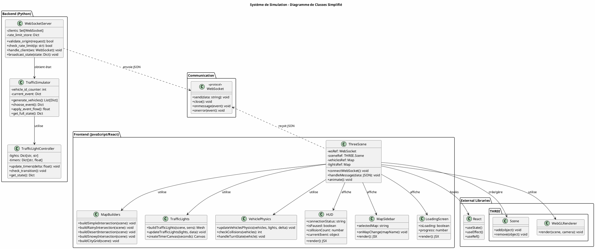

# Diagrammes du Projet - Simulation de Feux de Circulation

Ce fichier contient les diagrammes architecturaux du système de simulation.

---

## 1. Workflow Global - Flux de Données du Serveur au Frontend

Ce diagramme montre comment les données circulent depuis le backend Python (Render) jusqu'au frontend React (Netlify), avec le rôle de GitHub Actions.



### Version Alternative (Flux de Données ASCII)

```
┌─────────────────────────────────────────────────────────────────┐
│                    GITHUB ACTIONS (CI/CD)                       │
│  ┌───────────────────────────────────────────────────────────┐  │
│  │  Cron: */14 * * * * (Toutes les 14 minutes)              │  │
│  │  Action: curl GET https://.../healthz                    │  │
│  └───────────────────────────────────────────────────────────┘  │
└───────────────────────────┬─────────────────────────────────────┘
                            │ HTTP GET (Keep Server Alive)
                            ▼
┌─────────────────────────────────────────────────────────────────┐
│              BACKEND - RENDER.COM (Python 3.12)                 │
│  ┌──────────────────────────────────────────────────────────┐   │
│  │  traffic_simulation.py                                   │   │
│  │  ┌────────────────────┐   ┌────────────────────────┐    │   │
│  │  │TrafficLightCtrl    │   │ TrafficSimulator       │    │   │
│  │  │- update_timers()   │   │- generate_vehicles()   │    │   │
│  │  │- check_transition()│   │- apply_events()        │    │   │
│  │  │  VERT → JAUNE      │   │- calculate_flow()      │    │   │
│  │  │  JAUNE → ROUGE     │   └────────────────────────┘    │   │
│  │  └────────────────────┘                                  │   │
│  │                                                           │   │
│  │  État du Trafic (JSON):                                  │   │
│  │  {                                                        │   │
│  │    "Lights": [                                           │   │
│  │      {"Sens": "N", "Couleur": "GREEN", "Timer": 25.3}   │   │
│  │    ],                                                     │   │
│  │    "Vehicles": [                                         │   │
│  │      {"Id": 42, "Sens": "S", "Position": 12.5}          │   │
│  │    ],                                                     │   │
│  │    "Event": {"name": "Rush Hour", "flow_mult": 1.8}     │   │
│  │  }                                                        │   │
│  └──────────────────────────────────────────────────────────┘   │
│                                                                  │
│  ┌──────────────────────────────────────────────────────────┐   │
│  │  server.py (WebSocketServer)                             │   │
│  │  - validate_origin()   ✓ Sécurité                        │   │
│  │  - check_rate_limit()  ✓ Rate Limiting                   │   │
│  │  - broadcast_state()   → Diffusion à tous les clients    │   │
│  └──────────────────────────────────────────────────────────┘   │
└───────────────────────────┬─────────────────────────────────────┘
                            │
                            │ WebSocket (wss://)
                            │ Messages JSON toutes les 0.1s - 60s
                            ▼
┌─────────────────────────────────────────────────────────────────┐
│             FRONTEND - NETLIFY (React 18 + Three.js)            │
│  ┌──────────────────────────────────────────────────────────┐   │
│  │  ThreeScene.jsx (Orchestrateur)                          │   │
│  │  - Connexion WebSocket                                   │   │
│  │  - Réception des états JSON                              │   │
│  │  - Dispatch vers composants                              │   │
│  └──────────────────┬───────────────────┬───────────────────┘   │
│                     │                   │                        │
│     ┌───────────────▼──────┐    ┌──────▼────────────────┐       │
│     │ RENDU 3D             │    │ INTERFACE GUI          │       │
│     │                      │    │                        │       │
│     │ • MapBuilders.js     │    │ • HUD.jsx              │       │
│     │   └→ 5 Cartes 3D     │    │   └→ Statut + Pause    │       │
│     │                      │    │                        │       │
│     │ • TrafficLights.js   │    │ • LoadingScreen.jsx    │       │
│     │   └→ Feux + Timer    │    │   └→ Transitions       │       │
│     │                      │    │                        │       │
│     │ • VehiclePhysics.js  │    │ • MapSidebar.jsx       │       │
│     │   └→ Physique        │    │   └→ Choix Carte       │       │
│     │   └→ Collisions      │    │                        │       │
│     └──────────┬───────────┘    └────────┬───────────────┘       │
│                │                         │                        │
│                └─────────┬───────────────┘                        │
│                          ▼                                        │
│              ┌─────────────────────────┐                          │
│              │  Scène Three.js         │                          │
│              │  - Camera               │                          │
│              │  - Lights               │                          │
│              │  - Renderer (WebGL)     │                          │
│              │  - 60 FPS Animation     │                          │
│              └─────────────────────────┘                          │
└───────────────────────────┬─────────────────────────────────────┘
                            │
                            │ Canvas 3D + Interface HTML
                            ▼
                   ┌─────────────────┐
                   │   Navigateur    │
                   │   Utilisateur   │
                   └─────────────────┘
```

---

## 2. Architecture Frontend - Comportement des Fichiers

Ce diagramme montre comment chaque fichier se comporte et comment ils fusionnent vers le frontend final.



### Version Alternative (Flux des Fichiers)

```
┌─────────────────────────────────────────────────────────────────┐
│                    POINT D'ENTRÉE                               │
│  index.html  →  main.jsx  →  Montage React DOM                  │
└────────────────────────────┬────────────────────────────────────┘
                             │
                             ▼
┌─────────────────────────────────────────────────────────────────┐
│              ORCHESTRATEUR: ThreeScene.jsx                      │
│  ┌──────────────────────────────────────────────────────────┐   │
│  │  • Connexion WebSocket (useEffect)                       │   │
│  │  • Initialisation Three.js (Scene, Camera, Renderer)    │   │
│  │  • Boucle d'Animation 60 FPS (requestAnimationFrame)    │   │
│  │  • État Global (useRef pour scene, vehicles, lights)    │   │
│  └──────────────────────────────────────────────────────────┘   │
└──────┬────────────────────────────┬──────────────────┬──────────┘
       │                            │                  │
       │                            │                  │
   ┌───▼──────┐              ┌──────▼──────────┐  ┌───▼──────────┐
   │ UTILS    │              │ RENDU 3D        │  │ GUI          │
   │          │              │                 │  │              │
   │ Const... │◄─────────────┤ MapBuilders.js  │  │ HUD.jsx      │
   │ Turn...  │              │ ━━━━━━━━━━━━━━━ │  │ ━━━━━━━━━━━━ │
   └──────────┘              │ Comportement:   │  │ Comportement:│
       ▲                     │ - buildSimple   │  │ - Affiche    │
       │                     │   Intersection  │  │   statut WS  │
       │                     │ - buildRainy    │  │ - Bouton     │
       │                     │ - buildDesert   │  │   Pause/Play │
       │                     │ - buildSnowy    │  │ - Compteur   │
       │                     │ - buildCityGrid │  │   collisions │
       │                     │ ━━━━━━━━━━━━━━━ │  │ ━━━━━━━━━━━━ │
       │                     │ Retour:         │  │ Retour:      │
       │                     │ ✓ Géométries    │  │ ✓ JSX Comp.  │
       │                     │ ✓ Meshes 3D     │  └──────┬───────┘
       │                     │ ✓ Materials     │         │
       │                     └────────┬────────┘         │
       │                              │                  │
       │                     ┌────────▼────────┐         │
       │                     │TrafficLights.js │         │
       │                     │━━━━━━━━━━━━━━━━ │  ┌──────▼──────┐
       │                     │ Comportement:   │  │MapSidebar   │
       │                     │ - buildTraffic  │  │  .jsx       │
       │                     │   Lights()      │  │━━━━━━━━━━━━ │
       │                     │ - Canvas pour   │  │Comportement:│
       │                     │   Timer         │  │- 5 boutons  │
       │                     │ - updateLights  │  │- onClick    │
       │                     │ ━━━━━━━━━━━━━━━ │  │- Change map │
       │                     │ Retour:         │  │━━━━━━━━━━━━ │
       │                     │ ✓ Feux 3D       │  │Retour:      │
       │                     │ ✓ Ampoules R/Y/G│  │✓ JSX Comp.  │
       │                     └────────┬────────┘  └──────┬───────┘
       │                              │                  │
       │                     ┌────────▼────────┐         │
       │                     │VehiclePhysics.js│  ┌──────▼──────┐
       └─────────────────────┤━━━━━━━━━━━━━━━━ │  │LoadingScreen│
                             │ Comportement:   │  │  .jsx       │
                             │ - updateVehicles│  │━━━━━━━━━━━━ │
                             │   Physics()     │  │Comportement:│
                             │ - Machine à     │  │- Affiche    │
                             │   États (TURN)  │  │  pendant    │
                             │ - checkCollision│  │  transition │
                             │ ━━━━━━━━━━━━━━━ │  │- Progress   │
                             │ Retour:         │  │  bar        │
                             │ ✓ Positions     │  │━━━━━━━━━━━━ │
                             │ ✓ Rotations     │  │Retour:      │
                             │ ✓ Collision     │  │✓ JSX Comp.  │
                             │   Count         │  └──────┬───────┘
                             └────────┬────────┘         │
                                      │                  │
    ┌─────────────────────────────────┼──────────────────┘
    │                                 │
    │         FUSION DANS L'ORCHESTRATEUR (ThreeScene.jsx)
    │
    ▼
┌─────────────────────────────────────────────────────────────────┐
│                   SCÈNE THREE.JS                                │
│  ┌──────────────────────────────────────────────────────────┐   │
│  │  Scene (THREE.Scene)                                     │   │
│  │    ├── Géométries de MapBuilders (Routes, Bâtiments)    │   │
│  │    ├── Meshes de TrafficLights (Feux 3D + Timers)       │   │
│  │    ├── Meshes de Véhicules (mis à jour par Physics)     │   │
│  │    ├── Camera (PerspectiveCamera)                       │   │
│  │    └── Lumières (AmbientLight, DirectionalLight)        │   │
│  │                                                          │   │
│  │  WebGLRenderer.render(scene, camera)  →  60 FPS         │   │
│  └──────────────────────────────────────────────────────────┘   │
└────────────────────────────┬────────────────────────────────────┘
                             │
                             ▼
┌─────────────────────────────────────────────────────────────────┐
│                  SORTIE FINALE FRONTEND                         │
│  ┌──────────────────────────────────────────────────────────┐   │
│  │  CANVAS 3D (Three.js Renderer)                           │   │
│  │    └── Animation 3D de l'intersection                    │   │
│  │                                                           │   │
│  │  + INTERFACE HTML (Composants React)                     │   │
│  │    ├── HUD (overlay en haut)                             │   │
│  │    ├── MapSidebar (à droite)                             │   │
│  │    └── LoadingScreen (transitions)                       │   │
│  └──────────────────────────────────────────────────────────┘   │
│                                                                  │
│              Affiché dans le Navigateur Utilisateur             │
└─────────────────────────────────────────────────────────────────┘
```

---

## 3. Architecture Backend Python - Structure des Fichiers

Ce diagramme montre comment les fichiers Python se comportent et interagissent dans le backend.



### Version Alternative (Structure Backend)

```
┌─────────────────────────────────────────────────────────────────┐
│                    POINT D'ENTRÉE: traffic.py                   │
│  ┌──────────────────────────────────────────────────────────┐   │
│  │  • load_dotenv() → Charge variables .env                │   │
│  │  • simulator = TrafficSimulator()                       │   │
│  │  • server = WebSocketServer(simulator)                  │   │
│  │  • app.run() → Lance serveur aiohttp                    │   │
│  └──────────────────────────────────────────────────────────┘   │
└──────┬──────────────────────────────┬────────────────┬──────────┘
       │                              │                │
       │                              │                │
   ┌───▼──────┐              ┌────────▼────────┐  ┌───▼──────────┐
   │ CONFIG   │              │ LOGIQUE MÉTIER  │  │ RÉSEAU       │
   │          │              │                 │  │              │
   │ .env     │              │ traffic_        │  │ server.py    │
   │ ├─ PORT  │              │ simulation.py   │  │ ━━━━━━━━━━━━ │
   │ ├─ ORIGINS│             │ ━━━━━━━━━━━━━━━ │  │              │
   │ └─ MAX...│              │                 │  │ WebSocket    │
   │          │              │ TrafficLight    │  │ Server:      │
   │ requirements│           │ Controller      │  │              │
   │ .txt     │              │ ━━━━━━━━━━━━━━━ │  │ - validate   │
   │ ├─ aiohttp│             │ Comportement:   │  │   _origin()  │
   │ └─ dotenv│              │ - update_timers │  │ - check_rate │
   └──────────┘              │ - check_        │  │   _limit()   │
                             │   transition    │  │ - handle_    │
                             │                 │  │   client()   │
                             │ Machine États:  │  │ - broadcast  │
                             │ GREEN → YELLOW  │  │   _state()   │
                             │ YELLOW → RED    │  │              │
                             │ RED → GREEN     │  │ Sécurité:    │
                             │                 │  │ ✓ 10/min/IP  │
                             │ État:           │  │ ✓ Max 100    │
                             │ {               │  │ ✓ Heartbeat  │
                             │   'N': 'GREEN', │  │              │
                             │   'S': 'GREEN', │  │ Routes HTTP: │
                             │   'E': 'RED',   │  │ GET /healthz │
                             │   'W': 'RED'    │  │ GET /metrics │
                             │ }               │  │              │
                             │ ━━━━━━━━━━━━━━━ │  └──────┬───────┘
                             │                 │         │
                             │ TrafficSimulator│         │
                             │ ━━━━━━━━━━━━━━━ │         │
                             │ Comportement:   │         │
                             │ - generate_     │         │
                             │   vehicles()    │         │
                             │ - choose_event()│         │
                             │ - apply_event   │         │
                             │   _flow()       │         │
                             │                 │         │
                             │ État:           │         │
                             │ - vehicle_id    │         │
                             │ - current_event │         │
                             │ - controller    │         │
                             │                 │         │
                             │ Événements:     │         │
                             │ • Rush Hour     │         │
                             │ • Accident      │         │
                             │ • Bad Weather   │         │
                             │ • Nearby Event  │         │
                             │ • Construction  │         │
                             └────────┬────────┘         │
                                      │                  │
    ┌─────────────────────────────────┼──────────────────┘
    │                                 │
    │         FUSION DANS server.py (WebSocketServer)
    │
    ▼
┌─────────────────────────────────────────────────────────────────┐
│              DIFFUSION VERS CLIENTS WEBSOCKET                   │
│  ┌──────────────────────────────────────────────────────────┐   │
│  │  Toutes les 0.1s - 60s:                                  │   │
│  │  {                                                        │   │
│  │    "Lights": [                                           │   │
│  │      {"Sens": "N", "Couleur": "GREEN", "Timer": 25.3,   │   │
│  │       "ExpiresAt": 1737486156234}                        │   │
│  │    ],                                                     │   │
│  │    "Vehicles": [                                         │   │
│  │      {"Id": 42, "Sens": "S", "Voie": "Lane1",           │   │
│  │       "Position": 12.5, "Speed": 11.2}                  │   │
│  │    ],                                                     │   │
│  │    "Event": {                                            │   │
│  │      "name": "Rush Hour",                                │   │
│  │      "flow_mult": 1.8                                    │   │
│  │    },                                                     │   │
│  │    "ServerTime": 1737486129234,                          │   │
│  │    "Reset": true                                         │   │
│  │  }                                                        │   │
│  └──────────────────────────────────────────────────────────┘   │
│                                                                  │
│     Broadcast à tous les clients WebSocket connectés            │
└─────────────────────────────────────────────────────────────────┘
```

---

## 4. Diagramme de Déploiement

Ce diagramme montre l'infrastructure de déploiement complète avec les plateformes d'hébergement.



### Version Alternative (Infrastructure de Déploiement)

```
┌─────────────────────────────────────────────────────────────────┐
│                        DÉVELOPPEUR                              │
│  ┌──────────────────────────────────────────────────────────┐   │
│  │  Poste Windows 11 + VS Code + Git                       │   │
│  │  $ git add .                                             │   │
│  │  $ git commit -m "feature"                               │   │
│  │  $ git push origin master                                │   │
│  └───────────────────────────┬──────────────────────────────┘   │
└──────────────────────────────┼──────────────────────────────────┘
                                │
                                ▼
┌─────────────────────────────────────────────────────────────────┐
│                   GITHUB REPOSITORY                             │
│  ┌──────────────────────────────────────────────────────────┐   │
│  │  Repository: Yassine-Frigui/Traffic-light               │   │
│  │  Branch: master                                          │   │
│  │                                                          │   │
│  │  ├── src/                    (Frontend React)           │   │
│  │  ├── traffic.py              (Backend Python)           │   │
│  │  ├── .github/workflows/      (CI/CD)                    │   │
│  │  ├── netlify.toml                                       │   │
│  │  └── requirements.txt                                   │   │
│  └──────────────────────────────────────────────────────────┘   │
│                                                                  │
│  ┌──────────────────────────────────────────────────────────┐   │
│  │  GitHub Actions Workflow                                │   │
│  │  ━━━━━━━━━━━━━━━━━━━━━━━━━━━━━━━━━━━━━━━━━━━━━━━━━━━━ │   │
│  │  name: Keep Alive                                       │   │
│  │  on:                                                    │   │
│  │    schedule:                                            │   │
│  │      - cron: '*/14 * * * *'  # Toutes les 14 min       │   │
│  │  jobs:                                                  │   │
│  │    ping:                                                │   │
│  │      steps:                                             │   │
│  │        - run: curl GET .../healthz                      │   │
│  └──────────────────────────────────────────────────────────┘   │
└────────┬────────────────────────────────┬─────────┬─────────────┘
         │                                │         │
         │ Auto Deploy                    │         │ HTTP GET
         │ (on push)                      │         │ /healthz
         │                                │         │ (ping)
         ▼                                ▼         ▼
┌─────────────────────┐      ┌──────────────────────────────────┐
│   NETLIFY CDN       │      │      RENDER.COM                  │
│   ━━━━━━━━━━━━━━━━  │      │      ━━━━━━━━━━━━━━━━━━━━━━━━━  │
│                     │      │                                  │
│  Build Process:     │      │  Build Process:                  │
│  ┌────────────────┐ │      │  ┌──────────────────────────┐   │
│  │ 1. npm install │ │      │  │ 1. pip install -r        │   │
│  │ 2. npm run     │ │      │  │    requirements.txt      │   │
│  │    build       │ │      │  │ 2. python traffic.py     │   │
│  └────────┬───────┘ │      │  └────────┬─────────────────┘   │
│           │         │      │            │                     │
│           ▼         │      │            ▼                     │
│  ┌────────────────┐ │      │  ┌──────────────────────────┐   │
│  │ CDN Global     │ │      │  │ Backend Server Running   │   │
│  │ Edge Servers   │ │      │  │ ━━━━━━━━━━━━━━━━━━━━━━━ │   │
│  │ SSL/TLS Auto   │ │      │  │ • Python 3.12 Container  │   │
│  │                │ │      │  │ • aiohttp on Port 10000  │   │
│  │ Serve:         │ │      │  │ • WebSocket Server       │   │
│  │ dist/          │ │      │  │ • Traffic Simulation     │   │
│  │ ├─ index.html  │ │      │  │                          │   │
│  │ ├─ assets/     │ │      │  │ Endpoints:               │   │
│  │ └─ *.js, *.css │ │      │  │ • GET /healthz → 200 OK  │   │
│  └────────┬───────┘ │      │  │ • GET /metrics → JSON    │   │
│           │         │      │  │ • WS  /ws → WebSocket    │   │
│  URL:              │      │  └────────┬─────────────────┘   │
│  iteam-traffic-    │      │            │                     │
│  light.netlify.app │      │  URL:                            │
└───────────┬─────────┘      │  traffic-light-ugoe              │
            │                │  .onrender.com                   │
            │                └────────┬─────────────────────────┘
            │                         │
            │                         │ WebSocket
            │    ┌────────────────────┘ (wss://)
            │    │                      
            │    │ ┌──────────────────────────────────────────┐
            └────┼─►  GitHub Actions Ping (Keep Alive)       │
                 │ │  HTTP GET /healthz                        │
                 │ │  Backend responds: 200 OK                 │
                 │ │  Prevents server sleep                    │
                 │ └──────────────────────────────────────────┘
                 │
                 ▼
┌─────────────────────────────────────────────────────────────────┐
│                    UTILISATEURS FINAUX                          │
│  ┌──────────────┐    ┌──────────────┐    ┌──────────────┐      │
│  │  Client 1    │    │  Client 2    │    │  Client N    │      │
│  │  Chrome      │    │  Firefox     │    │  Edge/Safari │      │
│  │              │    │              │    │              │      │
│  │  1. HTTPS    │    │  1. HTTPS    │    │  1. HTTPS    │      │
│  │  ↓ HTML/JS   │    │  ↓ HTML/JS   │    │  ↓ HTML/JS   │      │
│  │  ← Netlify   │    │  ← Netlify   │    │  ← Netlify   │      │
│  │              │    │              │    │              │      │
│  │  2. WSS      │    │  2. WSS      │    │  2. WSS      │      │
│  │  ↔ JSON      │    │  ↔ JSON      │    │  ↔ JSON      │      │
│  │  ↔ Render    │    │  ↔ Render    │    │  ↔ Render    │      │
│  │              │    │              │    │              │      │
│  │  3. Rendu 3D │    │  3. Rendu 3D │    │  3. Rendu 3D │      │
│  │  🎨 Three.js │    │  🎨 Three.js │    │  🎨 Three.js │      │
│  └──────────────┘    └──────────────┘    └──────────────┘      │
└─────────────────────────────────────────────────────────────────┘

FLUX DE DONNÉES:
1. Développeur push → GitHub → Auto-deploy (Netlify + Render)
2. GitHub Actions → Ping backend /healthz toutes les 14 min
3. Utilisateur → HTTPS vers Netlify CDN → Récupère app React
4. App React → WebSocket vers Render backend → Simulation temps réel
5. Backend → Broadcast états → Tous les clients connectés
```

---

## 3. Diagramme UML - Diagramme de Séquence (PlantUML)

Ce diagramme montre l'interaction temporelle entre les différents composants du système.

```plantuml
@startuml
skinparam backgroundColor #FEFEFE
skinparam sequenceMessageAlign center
skinparam shadowing false
skinparam ParticipantPadding 20
skinparam BoxPadding 10

title Système de Simulation de Feux de Circulation - Diagramme de Séquence

actor Utilisateur as User
participant "Navigateur\nWeb" as Browser
participant "Frontend\n(Netlify)" as Frontend
participant "WebSocket\nConnection" as WS
participant "Backend\n(Render)" as Backend
participant "GitHub\nActions" as GHA

== Workflow de Maintien du Serveur ==
activate GHA
GHA -> Backend : GET /healthz\n(Toutes les 14 min)
activate Backend
Backend --> GHA : 200 OK
deactivate Backend
deactivate GHA

== Connexion Initiale ==
User -> Browser : Accès à l'application\nhttps://iteam-traffic-light.netlify.app
activate Browser
Browser -> Frontend : Requête HTTP
activate Frontend
Frontend --> Browser : HTML + JS Bundle
Browser -> Browser : Parse HTML\nCharger React + Three.js

Browser -> Frontend : Montage React\n(ReactDOM.render)
Frontend -> Frontend : useEffect() déclenché\nInitialisation

Frontend -> WS : new WebSocket(\n"wss://traffic-light-ugoe.onrender.com")
activate WS
WS -> Backend : Upgrade: websocket\nOrigin: netlify.app
activate Backend

Backend -> Backend : validate_origin()\ncheck_rate_limit()

alt Validation Réussie
    Backend --> WS : 101 Switching Protocols
    WS --> Frontend : onopen event
    
    Backend -> Backend : Ajouter client à la liste
    Backend -> Backend : Générer état initial
    
    Backend -> WS : État Initial JSON:\n{\n  "Lights": [...],\n  "Vehicles": [...],\n  "Event": {...}\n}
    WS -> Frontend : onmessage event
    
    Frontend -> Frontend : Initialiser Scène Three.js:\n- buildMap()\n- buildTrafficLights()\n- Créer véhicules
    
    Frontend -> Browser : Rendu Canvas 3D +\nInterface (HUD, Sidebar)
    Browser -> User : Afficher simulation 3D
    
else Validation Échouée
    Backend --> WS : 403 Forbidden / 429 Rate Limited
    WS --> Frontend : onerror event
    Frontend -> Browser : Afficher message d'erreur
    Browser -> User : "Connexion refusée"
end

== Boucle de Simulation Temps Réel ==

loop Toutes les 0.1 secondes
    Backend -> Backend : update_timers()\ncheck_transitions()
end

loop Toutes les 1 seconde (si changement)
    Backend -> Backend : État feux modifié ?\nVERT → JAUNE → ROUGE
    Backend -> WS : Broadcast état feux:\n{"Lights": [...]}
    WS -> Frontend : onmessage event
    Frontend -> Frontend : updateTrafficLights():\nChanger couleur ampoules\nMettre à jour Canvas Timer
    Frontend -> Browser : Rendu frame 3D
end

loop Toutes les 60 secondes
    Backend -> Backend : generate_vehicles()\nchoose_new_event()
    Backend -> WS : Broadcast complet:\n{\n  "Reset": true,\n  "Vehicles": [...],\n  "Event": {...}\n}
    WS -> Frontend : onmessage event
    Frontend -> Frontend : Nettoyer véhicules\nCréer nouveaux meshes
    Frontend -> Browser : Rendu nouveaux véhicules
    Browser -> User : Afficher nouvel état
end

loop Toutes les 30 secondes
    Backend -> WS : Ping (heartbeat)
    WS -> Frontend : Pong
    Frontend -> WS : Pong response
    WS -> Backend : Confirm alive
end

loop 60 FPS (Animation Continue)
    Frontend -> Frontend : requestAnimationFrame():\n- updateVehiclesPhysics()\n- checkCollisions()\n- renderer.render()
    Frontend -> Browser : Nouveau frame Canvas
    Browser -> User : Animation fluide
end

== Actions Utilisateur ==

User -> Browser : Clic bouton "Pause"
Browser -> Frontend : onClick event
Frontend -> Frontend : pauseRef.current = true\nArrêter loop animation
Frontend -> Browser : Mettre à jour bouton\n"Pause" → "Play"

User -> Browser : Sélectionner nouvelle carte\n(ex: "Desert")
Browser -> Frontend : onClick event
Frontend -> Frontend : setIsLoading(true)
Frontend -> Browser : Afficher LoadingScreen
Frontend -> Frontend : Nettoyer géométries:\nremoveMap()\nremoveVehicles()
Frontend -> Frontend : buildDesertIntersection()
Frontend -> Frontend : setIsLoading(false)
Frontend -> Browser : Masquer LoadingScreen\nAfficher nouvelle carte
Browser -> User : Carte désert visible

User -> Browser : Déplacer souris\n(Contrôle caméra)
Browser -> Frontend : onMouseMove event
Frontend -> Frontend : Mettre à jour\nCamera.position\nCamera.rotation
Frontend -> Browser : Rendu avec nouveau\nangle de vue
Browser -> User : Vue 3D modifiée

== Déconnexion ==

User -> Browser : Fermer onglet/navigateur
Browser -> Frontend : beforeunload event
Frontend -> WS : ws.close()
WS -> Backend : Client déconnecté
Backend -> Backend : Retirer client de la liste\nNettoyer ressources
deactivate Backend
deactivate WS
deactivate Frontend
deactivate Browser

@enduml
```



---

## 7. Diagramme de Flux de Déploiement (Netlify, Render, GitHub Actions)

Ce diagramme montre le flux de déploiement automatique du code vers les plateformes de production.



### Version Simplifiée (ASCII)

```
┌─────────────┐
│ Développeur │
└──────┬──────┘
       │ git push
       ▼
┌─────────────────────┐
│  GitHub Repository  │
└──────┬──────┬───────┘
       │      │
       │      │ Webhook
       │      ▼
       │  ┌────────────┐      npm run build
       │  │  Netlify   ├──────────────────► Frontend déployé
       │  └────────────┘                    (CDN Global)
       │
       │  ┌────────────┐      python traffic.py
       ├──┤   Render   ├──────────────────► Backend déployé
       │  └─────▲──────┘                    (Serveur WebSocket)
       │        │
       │        │ HTTP GET /healthz
       │        │ (toutes les 14 min)
       │  ┌─────┴──────┐
       └──┤  GitHub    │
          │  Actions   │
          │ (Keep-Alive)│
          └────────────┘
```

---

---

## 7. Diagramme de Flux de Déploiement (Netlify, Render, GitHub Actions)

Ce diagramme montre le flux de déploiement automatique du code vers les plateformes de production.


### Version Simplifiée (ASCII)

```
┌─────────────┐
│ Développeur │
└──────┬──────┘
       │ git push
       ▼
┌─────────────────────┐
│  GitHub Repository  │
└──────┬──────┬───────┘
       │      │
       │      │ Webhook
       │      ▼
       │  ┌────────────┐      npm run build
       │  │  Netlify   ├──────────────────► Frontend déployé
       │  └────────────┘                    (CDN Global)
       │
       │  ┌────────────┐      python traffic.py
       ├──┤   Render   ├──────────────────► Backend déployé
       │  └─────▲──────┘                    (Serveur WebSocket)
       │        │
       │        │ HTTP GET /healthz
       │        │ (toutes les 14 min)
       │  ┌─────┴──────┐
       └──┤  GitHub    │
          │  Actions   │
          │ (Keep-Alive)│
          └────────────┘
```

---

### Version Alternative (Diagramme d'Activité PlantUML)



### Version Alternative (Diagramme de Classes PlantUML)




---

## Notes d'Utilisation

### Pour Visualiser ces Diagrammes :

#### Diagrammes Mermaid (Diagrammes 1 et 2)
1. **VS Code** : Installer l'extension "Markdown Preview Mermaid Support"
2. **GitHub** : Les diagrammes Mermaid s'affichent automatiquement
3. **Éditeurs en ligne** :
   - https://mermaid.live/
   - https://mermaid-js.github.io/mermaid-live-editor/

#### Diagrammes PlantUML (Diagramme 3)
1. **VS Code** : Installer l'extension "PlantUML"
2. **En ligne** :
   - http://www.plantuml.com/plantuml/uml/
   - https://plantuml-editor.kkeisuke.com/
3. **Export** : Les diagrammes PlantUML peuvent être exportés en PNG, SVG, ou PDF

### Pour Intégrer dans LaTeX :

1. **Exporter les diagrammes en images** :
   - Mermaid : Aller sur https://mermaid.live/, coller le code, cliquer "Export as PNG/SVG"
   - PlantUML : Copier le code dans http://www.plantuml.com/plantuml/, télécharger l'image

2. **Créer un dossier `diagrams/`** dans votre projet :
   ```
   projet_sem_pythob/
   ├── diagrams/
   │   ├── workflow_global.png
   │   ├── architecture_frontend.png
   │   └── diagramme_sequence.png
   ```

3. **Remplacer les placeholders dans le LaTeX** :
   ```latex
   \begin{figure}[H]
       \centering
       \includegraphics[width=\textwidth]{diagrams/workflow_global.png}
       \caption{Workflow global du système}
   \end{figure}
   ```

### Commandes LaTeX pour les Diagrammes

```latex
% Dans le préambule, assurez-vous d'avoir :
\usepackage{graphicx}
\usepackage{float}

% Pour un diagramme pleine largeur :
\begin{figure}[H]
    \centering
    \includegraphics[width=\textwidth]{diagrams/nom_diagramme.png}
    \caption{Description du diagramme}
    \label{fig:nom_diagramme}
\end{figure}

% Pour un diagramme avec largeur personnalisée :
\begin{figure}[H]
    \centering
    \includegraphics[width=0.8\textwidth]{diagrams/nom_diagramme.png}
    \caption{Description du diagramme}
\end{figure}

% Pour référencer le diagramme dans le texte :
Comme illustré dans la figure \ref{fig:nom_diagramme}...
```

### Personnalisation

#### Couleurs Mermaid
Vous pouvez personnaliser les couleurs des diagrammes Mermaid en ajoutant :
```mermaid
%%{init: {'theme':'base', 'themeVariables': { 
  'primaryColor':'#61dafb',
  'primaryTextColor':'#000',
  'primaryBorderColor':'#000',
  'lineColor':'#F8B229',
  'secondaryColor':'#006100',
  'tertiaryColor':'#fff'
}}}%%
```

#### Styles PlantUML
Vous pouvez modifier les styles dans PlantUML :
```plantuml
skinparam backgroundColor #FFFFFF
skinparam sequenceArrowColor #3776ab
skinparam sequenceParticipantBackgroundColor #61dafb
skinparam shadowing false
```

---

## Correspondance avec le Rapport LaTeX

Les diagrammes correspondent aux sections suivantes du rapport :

| Diagramme | Section LaTeX | Placeholder à remplacer |
|-----------|---------------|-------------------------|
| **1. Workflow Global** | Chapitre 2, Section 2.3 (Architecture Globale) | `DIAGRAMME D'ARCHITECTURE GLOBALE` |
| **2. Architecture Frontend** | Chapitre 3, Section 3.1 (Architecture Détaillée) | `DIAGRAMME DE COMPOSANTS FRONTEND` |
| **3. Architecture Backend Python** | Chapitre 3, Section 3.1 (Architecture Détaillée - Backend) | Nouveau diagramme à ajouter |
| **4. Diagramme de Déploiement** | Chapitre 3, Section 3.4 (Déploiement) | `DIAGRAMME DE DÉPLOIEMENT` |
| **5. Diagramme de Séquence UML** | Chapitre 3, Section 3.1 (Architecture Détaillée) | `DIAGRAMME DE SÉQUENCE` |
| **6. Diagramme de Séquence (Simplifié)** | Chapitre 3, Section 3.1 (Architecture Détaillée) | `DIAGRAMME DE SÉQUENCE` |
| **7. Flux de Déploiement CI/CD** | Chapitre 3, Section 3.4 (Déploiement) | Nouveau diagramme à ajouter |

---

## Références

- **Frontend** : https://iteam-traffic-light.netlify.app
- **Backend** : https://traffic-light-ugoe.onrender.com
- **Repository** : https://github.com/Yassine-Frigui/Traffic-light
- **Documentation Mermaid** : https://mermaid.js.org/
- **Documentation PlantUML** : https://plantuml.com/

